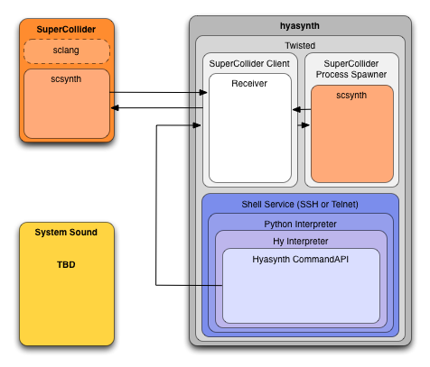

########
Hyasynth
########

.. image:: resources/logos/hyasynth-logo-192.png

.. contents:: **Table of Contents**

Quick Start
===========

Dependencies
------------

Hyasynth requires `SuperCollider`_ to be installed (and for now, running). You
can download the appropriate binary for your system at the SuperCollider
`downloads page`_.

The rest of the dependencies will be automatically installed by the ``make``
targets. The ``make`` target that installs the deps can, of course, be called
directly:

.. code:: bash

    $ make deps

Installation
------------

Installing Hyasynth is as simple as a git clone:

.. code:: bash

  $ git clone https://github.com/oubiwann/hyasynth.git
  $ cd hyasynth

The rest of this document assumes that you are in the ``hyasynth`` directory.

Running Hyasynth
----------------

To get Hyasynth up and running quickly, simply do this:

.. code:: bash

  $ make shell

This will create a virtualenv for you, compile things, install dependencies,
etc. If, in the future, you'd like to not check for deps, you can just do this:

.. code:: bash

  $ make shell-nodeps

After the setup steps complete, you will be logged into the Hyasynth shell and
greeted with a banner like the following:

.. code:: text

  :>
  : Welcome to
  :  _  _                       _   _
  : | || |_  _ __ _ ____  _ _ _| |_| |_
  : | __ | || / _` (_-< || | ' \  _| ' \
  : |_||_|\_, \__,_/__/\_, |_||_\__|_||_|
  :       |__/         |__/
  :
  : You have logged onto a Hyasynth Server; you are currently at a Hy
  : command prompt. Hy is a Lisp dialect of Python of which you can
  : learn more about here:
  :   https://github.com/hylang/hy
  : Information on Hyasynth is available here:
  :   http://github.com/oubiwann/hyasynth
  :
  : Type '(ls)' or '(dir)' to see the objects in the current namespace.
  : Use (help ...) to get API docs for available objects.
  :
  : Enjoy!
  :
  :>

You can check the status of your running SuperCollider server with the commend:

.. code:: lisp

  :> (status)
  {'status': {'synths': 0, 'groups': 1, 'peak cpu': 0.06004318222403526,
  'average cpu': 0.02159080281853676, 'loaded synths': 0,
  'nominal sample rate': 7.17291259765625, 'unit generators': 0,
  'actual sample rate': 0.0}}

If you haven't started the SuperCollider server, then you'll get a message like
this:

.. code:: lisp

  :> (status)
  {'status': 'connection refused'}

About Results in the REPL
-------------------------

Hyasynth is built on top of `Twisted`_ (this is how you can SSH into it!) and
the client communications with the SuperCollider server all happen via Twisted.
This also means that the results are often what are called "deferreds" (see the
Twisted `docs on deferreds`_ for more information).

Hyasynth works hard to hide this from the user, but if you want to manipulate
returned data, you need to know about it :-) Most of the times, you'll just
need to know how to get a hold of the returned data. For that, you will need
to access the ``result`` attribute of the returned deferred.

For instance, if you wanted to pretty-print the results of the ``(status)``
call, you'd do this:

.. code:: lisp

  :> (setv s (status))
  :> (pprint s.result)
  {'status': {'actual sample rate': 0.0,
              'average cpu': 0.022847207263112068,
              'groups': 1,
              'loaded synths': 0,
              'nominal sample rate': 7.17291259765625,
              'peak cpu': 0.0575711727142334,
              'synths': 0,
              'unit generators': 0}}
  :>

About ``twistd``
----------------

Behind the scenes, Hyasynth is an SSH server running Hy (Python Lisp; see
`HydeyHole`_). If you look at the ``Makefile``, you'll see that we're calling
an executable called ``twistd``. This is the Twisted command-line utility for
running servers, etc. Hyasynth provides a Twisted plugin that runs all the
necessary services. If you'd like to interact with this plugin directly, you
can do so on the command line:

.. code:: bash

  $ . .venv/bin/activate
  (.venv) $ twistd hyasynth --help
  Usage: twistd [options] hyasynth [options]
  Options:
    -s, --super-collider-port=  The SuperCollider port number. [default: 57110]
        --version               Display Twisted version and exit.
        --help                  Display this help and exit.
  Commands:
      keygen      Generate ssh keys for the server
      shell       Login to the server
      stop        Stop the server

As Hyasynth gets more features, we will update the Twisted plugin to offer more
command-line configuration options, and you will see those when you run the
plugin with the ``--help`` flag.

API Layout
==========

The current API calls that are implemented:

.. code:: text

  Hy Shell
  --------
   * app
   * banner
   * clear
   * dir
   * help
   * ls
   * quit

  SuperCollider Server
  --------------------
   * boot-internal-server
   * connect-external-server
   * connect-internal-server
   * kill-server
   * send
   * status / server-status

  Miscellany and Helpers
  ----------------------
   * config
   * os
   * pprint
   * sys

Architecture
============

The current architecture of Hyasynth is captured in this image:

.. Links
.. -----
.. _SuperCollider: http://supercollider.sourceforge.net/
.. _downloads page: http://supercollider.sourceforge.net/downloads/
.. _Twisted: http://twistedmatrix.com/
.. _docs on deferreds: http://twistedmatrix.com/documents/current/core/howto/defer.html
.. _HydeyHole: https://github.com/oubiwann/hydeyhole
